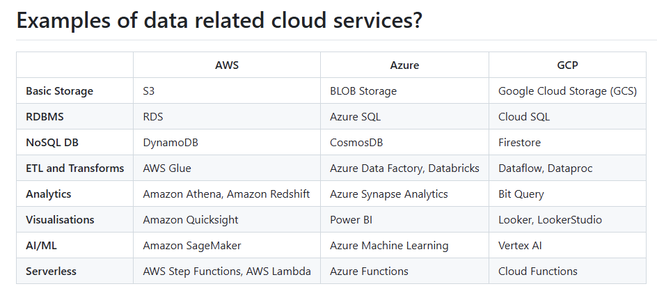

# Cloud Computing
- on demand 
- pay as you go 
- often has a cloud service platform (GUI)
- The cloud provider owns, maintains and manages hardware and networking and physical security.

multi-tenant-cloud - multiple tenants share the same physical servers (cost effective, zero maintainance, instant scalability but the noisy neighbor effect, less customisation)
single-tenant-cloud - a customer has access to their own server (expensive, slower to scale, higher maintainence but max security and privacy, consistent perfomrance and complete control)

Some examples of services:

## Multicloud
Multicloud is the practice of using cloud computing services from at least two different cloud providers to run a single application or manage an organization's overall IT infrastructure.

This is required by the FCA of fintech companies.

From this you get more reliability, no vendor locking, best of both worlds and geographic compliance.

## IaaS
Infrastructure as a Service
- Cloud provider manages the physical hardware, security, and networking in their data centers. 
- You are responsible for installing and managing the operating system, middleware, and any applications or data.
- Best for companies that want maximum flexibility and control over their IT resources without the upfront 
cost of buying hardware.
- Google Compute Engine, Amazon EC2, Microsoft Azure Virtual Machines.


## PaaS
Platform as a Service
- The cloud provider manages the physical hardware, operating systems, and runtime environments. 
You simply upload your application code and manage your data.
- Best for developers who want to rapidly build and deploy web or mobile applications without worrying about server configurations, 
load balancing, or operating system updates.
- Google App Engine, Heroku, Vercel, Render.

## SaaS
Software as a Service
- The cloud provider manages absolutely everything—from the physical hardware and operating systems to the application software, 
databases, and security. You just log in and use it.
- End-users and businesses that need everyday applications quickly and easily without any IT overhead.
- Google Workspace (Gmail, Docs, Drive), Salesforce, Slack, Netflix, Zoom.

## FaaS 
Function as a Service
- You write single, purpose-built functions and the cloud provider runs them entirely on-demand.
- AWS Lambda


## Advantages of Cloud Computing 
- Cost -> capex into opex (capital expendature into operational expendature) & economy of scale
- Scalability
- Accessibility
- Easy to collaborate 
- Compliance and security responsibility goes to the provider
- Easier backup 

## Potential Pitfalls 
- Unpredictable and spiralling costs if mismanaged 
- Internet dependency 
- Security and privacy 
- Vendor locking
- Compliance

## Big 3 Companies 
- AWS: been around for ages and quite safe
- Azure: integrates with all microsoft ecosystems
- Google: good for data, ML and AI options, flexible APIs, good with open source. Good multi-cloud option.

## SSH 
You must create an SSH (secure shell) key pair to access a protected resource.

## EC2
(ECC) Elastic Compute Cloud. 
An instance is a virtual machine

NOTE: You can use gitbash to run bash commands on a windows system 


To access your instance you can run 
```zsh
ssh -i ~/.ssh/[Key pair path].pem [OS Instance]@[IP Address]
```

If you need to push files to the instance, 
```zsh
scp -i ~/.ssh/[ssh key path].pem /[path to resource] [OS Instance]@[IP Address]:/[upload location path]
```


## S3 (Simple Storage Service)

- It is secure 
- Durable 
- Scalable

Data is stored in objects - (data + metadata) with metadata as key value pairs
Objects are the fundamental entities stored in Amazon S3. Objects are stored in buckets. 

Objects in the bucket are stored at the same level. The directory is a visual illusion.

S3 is basically a place to store raw data.
S3 + another system is a data lake

Industry standard is not to use CRUD on the console

Endpoints: An endpoint is the exact location where an API receives requests and sends back responses.

When you upload a file to an S3 bucket, AWS generates a unique HTTP web address for that object. It is good because you can offload compute server load, scale easily, be more cost effective, have better availability globally, and provide secure, temporary access.

You store your keys in the location `~/.aws/credentials`

### Storage Classes 
#### Standard 
Default class: high availability, low latency and high durabilty. It is the most expensive tier for storage, 
but the cheapest for accessing data. 

#### Intelligent Tiering 
Moves your data automatically between frequent and infrequent access tiers based on usage patterns. 

#### Standard-Infrequent Access 
This class provides the same low latency and high throughput as Standard, but with a lower storage cost and a higher retrieval fee.

#### One Zone-Infrequent Access
Other classes store data across at least three Availability Zones (AZs), this stores data in a single AZ.
It costs less but is less redundant.

#### Glacier Class
Extremely low storage costs but retrieval times are really long with higher costs.

