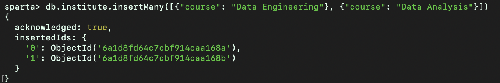
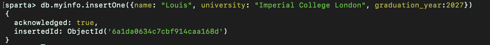
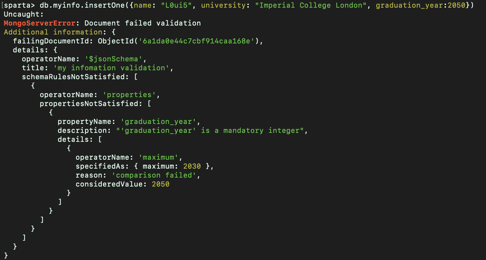
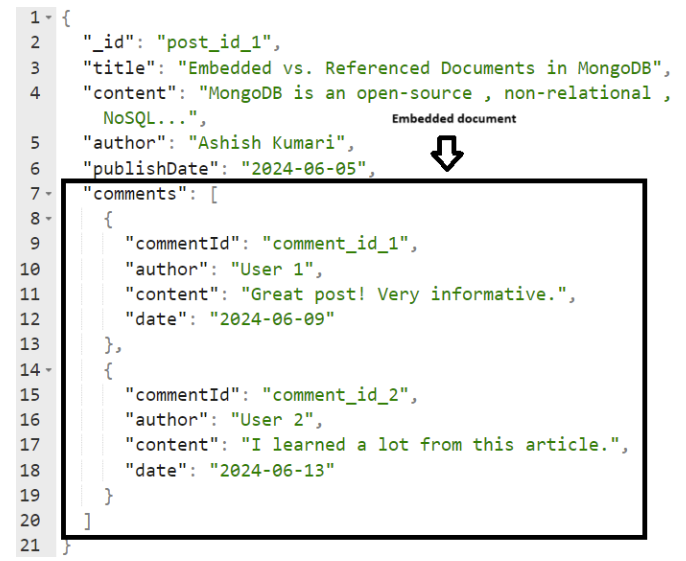
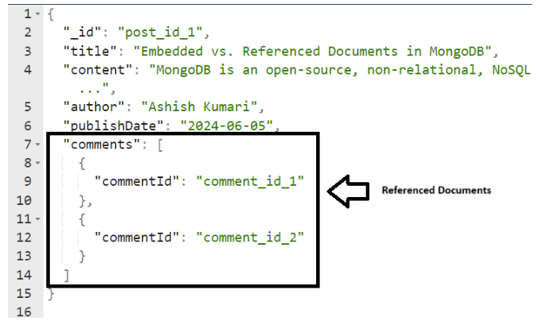

# NoSQL Databases 

NoSQL - NotOnlySQL 

 - Contains key value pairs, and the syntax varies from database to database 
 - Non-relational or distributed database system
 
 - Dynamic schema for unstructured data.
 - Different forms - key:values, documents, graph, column


 ##  ACID in sql
Properties of a reliable transaction 
- Atomic. A transaction is treated as a single, indivisible unit. If one step fails, the whole thing fails.
- Consistency. Any data written must be valid according to defined rules. 
- Isolation. Concurrent transactions must execute completely independently.
- Durability. Once a transaction has been committed, it remains forever.


##  MongoDB Intro 

A document like database that stores JSON-like documents, which allows you to store data with flexible schema and provides querying and aggregation tools for access and analysis. 
It uses BJSON (Binary-JSON)

###  Advantages 
- Document Oriented Storage
- High level of polymorphism - not every row must have the same columns (which is the case in SQL). There can be null fields 
- There is no translation required quite often 
- Easy scaling (Horizontal). Vertical scaling is making your single processor more beefy. Horizontal scaling is increasing the number of CPUs, so you can parallelise your workload.
    - Scaling horizontally is better for parallel processing, like in websites. Furthermore, 
- Fast/Efficient - so you can easily process high velocity data
- Open Source: You can view, edit, distribute and enhance the code (at will) 

Vendor Locking: The state of being locked into a particular provider contractually or due to infrastructure

###  Disadvantages 
- High memory usage and data redundancy 
- Can be inconsistent 
- Unsupported transactions

### Use Cases
- Social Media posts/data 
- API data (easy to map into mongoDB)
- Mobile app backend 
- Caching 
    - E.g. shopping cart 
- Product info
- Media files/data 
- CRM systems (customer relationship management)
    - Heavy text aspects
- CMS systems (customer management system)
- IoT and Sensor Data (there is lots of metadata - not as bothered about structure, just storage and query)
- Logs and monitoring data (things like splunk are better)
- Gaming data
- Chat systems/app


note: usually worth changing the default port to help with security


##   MongoShell 

By default, it will open with test> 
To create a database: 
```mongosh
use sparta
```

Can also use the db command to show the active database

To create a Table, use 

```mongosh 
db.createCollection("institute")
```

To insert a document (field) 

```mongosh
db.institute.insertOne({name:"New Document"})
```

You recieve an object ID, which you can use to reference the object from a different collection

To insert many documents simulataneously,
```mongosh
db.institute.insertMany([{"course": "Data Engineering"}, {"course": "Data Analysis"}])
```
Recieve two object IDs for example



### Validation 
To implement validation on creation of a document 
```mongosh 
db.createCollection("myinfo", {
    validator: {
        $jsonSchema: {
            bsonType: "object",
            title: "my infomation validation",
            required: ["name", "university", "graduation_year"],
            properties: {
                name: {
                    bsonType: "string",
                    description: "'name' is a required string" 
                },
                university: {
                    bsonType: "string",
                    description: "'university' is a required string"
                },
                graduation_year: {
                    bsonType: "int", 
                    minimum: 1900,
                    maximum: 2030, 
                    description: "'graduation_year' is a mandatory integer"
                }
            }
        }
    }
})
```

For example, 




### Searching 

To see your documents in a collection, run 
```mongosh
db.institute.find()
db.institute.find({course: "Data Engineering"})
db.institute.find({_id: ObjectId("6a1d8fd64c7cbf914caa168b")})
```


For example, creating the collection below 
```mongosh
db.createCollection("films", {
    validator: {
       $jsonSchema: {
          bsonType: "object", 
          title: "my favourite films validation", 
          required: ["name", "release_date"],
          properties: {
             name: {
                bsonType: "string",
                description: "'name' is a required string"
             },
             release_date: {
                bsonType: "date", 
                description: "'release_date' is mandatory and must be a valid datetime" 
             }
          }
       }
    }
 })

// inserting some lines 

db.films.insertMany([
   { 
      name: "The Lord of the Rings: The Fellowship of the Ring", 
      release_date: new Date("2001-12-19") 
   },
   { 
      name: "The Shawshank Redemption", 
      release_date: new Date("1994-10-14") 
   },
   { 
      name: "The Green Mile", 
      release_date: new Date("1999-12-10") 
   },
   { 
      name: "Forrest Gump", 
      release_date: new Date("1994-07-06") 
   },
   { 
      name: "Django Unchained", 
      release_date: new Date("2012-12-25") 
   }
])

db.films.insertOne({
    name: "The Matrix",
    release_date: new Date("1999-03-31")
 })

```

returns 
```mongosh 
{ ok: 1 }

{
  acknowledged: true,
  insertedIds: {
    '0': ObjectId('6a1da4514c7cbf914caa168f'),
    '1': ObjectId('6a1da4514c7cbf914caa1690'),
    '2': ObjectId('6a1da4514c7cbf914caa1691'),
    '3': ObjectId('6a1da4514c7cbf914caa1692'),
    '4': ObjectId('6a1da4514c7cbf914caa1693')
  }
}

{
  acknowledged: true,
  insertedId: ObjectId('6a1da4d24c7cbf914caa1694')
}

```
running seperately, 
```mongosh
db.films.find({name: "Forrest Gump"})
db.films.find({_id: ObjectId("6a1da4514c7cbf914caa168f")})
```
returns 
```mongosh
[
  {
    _id: ObjectId('6a1da4514c7cbf914caa1692'),
    name: 'Forrest Gump',
    release_date: ISODate('1994-07-06T00:00:00.000Z')
  }
]

[
  {
    _id: ObjectId('6a1da4514c7cbf914caa168f'),
    name: 'The Lord of the Rings: The Fellowship of the Ring',
    release_date: ISODate('2001-12-19T00:00:00.000Z')
  }
]
```

Though not exercised here, the `insert()` acts as either `insertMany` or `insertOne` depending on the input parameters.


### Updates

You can update an existing document, for example using `db.collection.updateOne()`. This requires a filter and an update operator as arguments. 

For example 
```mongosh
db.films.updateOne(
    {name: "The Matrix"},
    {$set: {genre: "Sci-Fi"}}
)

// returning, 
{
  acknowledged: true,
  insertedId: null,
  matchedCount: 1,
  modifiedCount: 1,
  upsertedCount: 0
}
```

You can also update many documents. To find all the films released before the year 2000, and label them as classics you run the below: 
```mongosh
db.films.updateMany(
    {release_date: {$lt: new Date("2000-01-01")}},
   {$set: {status: "Classic" }}
)

\\ returning, 
{
  acknowledged: true,
  insertedId: null,
  matchedCount: 4,
  modifiedCount: 4,
  upsertedCount: 0
}
```


### Deleting Documents

You can run the below to delete a document. With similar syntax for `deleteMany` and `delete` as before.
```mongosh
db.films.deleteOne({name: "Django Unchained"})

// returning 
{ acknowledged: true, deletedCount: 1 }
```


### Embedding and Referencing
- Referencing is the process of performing relational lookups on different collections. 
- Embedding removes the related data into a single table, in favour of having several related tables.

Embedding makes the most sense when data is regularly accessed together. Ie in a database of online orders, you would 
be unlikely to look up a customer without also looking up their address. 



Embedding works for 1-to-1 relationships, and 1-to-Many relationships where the Many side belongs only to the parent and does not grow infinitely. 

Referencing can represent all data relationships. <br>



## Python
### Virtual Environments 
An isolated, self-contained folder that houses specific program versions and its own version dependencies.
- Multiple projects may require different versions of the same tools
- It makes projects more portable and reproducible 
- It keeps your native python installation clean 
- Allows testing with different Python versions

### Libraries 
A group of modules that contain functions, classes and methods to perform common tasks

### Why Python 
- The libraries are extensive 
- Easy to learn use and read 
- Large community 
- Versatile