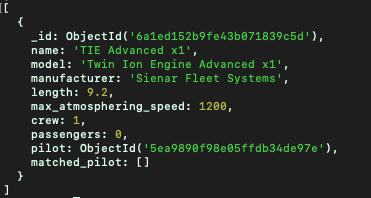

# Querying a Database

Take some examples from the StarWars database.

First we find a field specifying the name, and some of the parameters to show (denoted with param: 1) 
```mongosh
// to specify fields to show you list 1, 
db.characters.find({name:"Chewbacca"}, {name:1, eye_color: 1})
```
This returns 
```mongosh
[
  {
    _id: ObjectId('6a1ead7934466a47403fb8fe'),
    name: 'Chewbacca',
    eye_color: 'blue'
  }
]
```
Note the American spelling. To hide the _id field you write _id: 0 

```mongosh
db.characters.find({name:"Chewbacca"}, {name: 1, eye_color: 1. _id: 0})
```
which returns 
```mongosh 

[ 
  { 
    name: 'Chewbacca', eye_color: 'blue' 
  }
]

```

To find a field which takes a particular value
```mongosh 
db.characters.find( { "species.name": "Human" }, { name: 1, "homeworld.name": 1 } )
```
This gives you quite a few results...
```mongosh 
[
  {
    _id: ObjectId('6a1ead7934466a47403fb8b3'),
    name: 'Jango Fett',
    homeworld: { name: 'Concord Dawn' }
  },
  {
    _id: ObjectId('6a1ead7934466a47403fb8b7'),
    name: 'Anakin Skywalker',
    homeworld: { name: 'Tatooine' }
  },
  {
    _id: ObjectId('6a1ead7934466a47403fb8b8'),
    name: 'Cliegg Lars',
    homeworld: { name: 'Tatooine' }
  },
  ...

```


To filter on multiple things, 
```mongosh 
db.characters.find( 
    { 
        eye_color: { 
            $in: ["yellow", "orange"]
        }
    },
    { 
        name: 1, 
        eye_color: 1,
        _id: 0 
    } 
)
```

Can also have
```mongosh
db.characters.find( 
    { 
        $or: [
            { eye_color: "blue" },
            { gender: "female" }
        ]
    },
    { 
        name: 1, 
        eye_color: 1,
        gender: 1,
        _id: 0 
    } 
)
```

And for comparisons
```mongosh 
db.characters.find( { height: { $gt: '200'} } )
```

Option 1 - remove "unknown" then convert valid heights to int
```mongodb
db.characters.updateMany(
  {height: "unknown"},
  {$unset: {height: ""}}
)

db.characters.updateMany(
  {},
  [{$set: {height: {$toInt: "$height"}}}]
)
```

Option 2 - Use regex to select only docs with a valid height value:
```mongosh
db.characters.update(
  {height: /^[0-9]+$/},
  [{$set: {height: {$toInt: "$height"}}}],
  {multi: true }
)
```

Usually would avoid mutating data

## Aggregations

Performing an aggregation to sum all the heights,
```mongosh
db.characters.aggregate([
    { $match: { "species.name": "Human" } },
    { $group: { _id: null, total: { $sum: "$height" } } }
])
```

alternatively, if you want to group by something ie gender,
```mongosh 
db.characters.aggregate([
   { $match: { "species.name": "Human" } },
   { $group: { _id: "$gender", total: { $sum: "$height" } } } 
])
```

If you wanted to output the distinct species in the dataset, `db.characters.distinct("species.name")`

You can also count the occurrences of a species `db.characters.countDocuments({"species.name": "Human"})`


## Tasks
Convert mass to be double data type
```mongodb
db.characters.updateMany(
    {},
    [ { 
        $set: { 
            mass: { 
                $convert: {
                    input: "$mass",
                    to: "double",
                    onError: null,
                    onNull: null
                } 
            }
        }
    } ]
)
```

Find the maximum height per homeworld
```mongodb
db.characters.aggregate([
  {
    $group: {
      _id: "$homeworld.name",      
      maxHeight: { $max: "$height" }
    }
  }
])
```


From the Star Wars api, you can also reference using aggregations with other fields. Though this in particular 
requires two lookups.
We can create a starship 
```mongodb 
db.starships.insertOne({
  name: "TIE Advanced x1",
  model: "Twin Ion Engine Advanced x1",
  manufacturer: "Sienar Fleet Systems",
  length: 9.2,
  max_atmosphering_speed: 1200,
  crew: 1,
  passengers: 0,
  pilot: ObjectId("5ea9890f98e05ffdb34de97e")
})
```

```mongodb
db.starships.aggregate([
{ 
    $lookup: {
        from: "characters",
        localField: "pilot",
        foreignField: "_id",
        as: "matched_pilot"
        }
}
])
```

This query returns 



To add another ship, we search for the ids of some characters: 
```mongodb
db.characters.find({name: {$in: ["Chewbacca", "Han Solo", "Lando Calrissian", "Nien Nunb"]}}, {_id: 1})

// which returns, 
db.characters.find({name: {$in: ["Chewbacca", "Han Solo", "Lando Calrissian", "Nien Nunb"]}}, {_id: 1})
[
  { _id: ObjectId('6a1ead7934466a47403fb8bd') },
  { _id: ObjectId('6a1ead7934466a47403fb8e2') },
  { _id: ObjectId('6a1ead7934466a47403fb8f4') },
  { _id: ObjectId('6a1ead7934466a47403fb8fe') }
]
```

Creating the new starship, 
```mongodb 
db.starships.insertOne({
  name: "Millenium Falcon",
  model: "YT-1300 Light Freighter",
  manufacturer: "Corellian Engineering Corporation",
  length: 34.37,
  max_atmosphering_speed: 1050,
  crew: 4,
  passengers: 6,
  pilot: [
    ObjectId("6a1ead7934466a47403fb8bd"),
    ObjectId("6a1ead7934466a47403fb8e2"),
    ObjectId("6a1ead7934466a47403fb8f4"),
    ObjectId("6a1ead7934466a47403fb8fe")
  ]
  })
  
  // returning 
  {
  acknowledged: true,
  insertedId: ObjectId('6a1ed24b68712f97ff69de28')
  }
```

now we can run an aggregation 
```mongodb 
db.starships.aggregate([
  { $lookup: {
    from: "characters",
    localField: "pilot",
    foreignField: "_id",
    as: "matched_pilot"
  } },
  { $project: {name: 1, model: 1, "matched_pilot.name": 1}}
])

// which returns 

[
  {
    _id: ObjectId('6a1ed152b9fe43b071839c5d'),
    name: 'TIE Advanced x1',
    model: 'Twin Ion Engine Advanced x1',
    matched_pilot: []
  },
  {
    _id: ObjectId('6a1ed24b68712f97ff69de28'),
    name: 'Millenium Falcon',
    model: 'YT-1300 Light Freighter',
    matched_pilot: [
      { name: 'Nien Nunb' },
      { name: 'Chewbacca' },
      { name: 'Han Solo' },
      { name: 'Lando Calrissian' }
    ]
  }
]
```